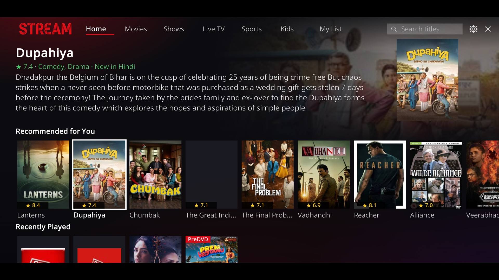

# Stream for Kodi

A poster-row home screen for Kodi that sits on top of the Sasta TV addon: tabs for Movies, Shows, Live TV and Kids,
Continue Watching, My List, ranked search, and a "Recommended for You" row.

Stream does not provide any content or accounts. It only re-presents what the Sasta TV addon already lists, and hands
playback to that addon, so Sasta TV must be installed and signed in on the same Kodi.

## Install

1. In Kodi, open **Settings → System → Add-ons** and turn on **Unknown sources**.
2. Open **Settings → File manager → Add source**, choose **<None>**, and enter
   `https://tinyurl.com/27flx4q2/` (keep the final slash). Name it `stream`.
3. Open **Add-ons → Install from zip file → stream** and choose `repository.stream-1.0.1.zip`.
4. Open **Add-ons → Install from repository → Stream Repository → Video add-ons → Stream** and install it.

Updates then arrive through the repository.

The short address forwards to `https://raw.githack.com/yeshvantbhavnasi/kodi-stream/main/`; if it ever stops
working, enter that full address in step 2 instead. Opened in a web browser the short address shows a TinyURL
preview page first, which Kodi does not see.

## Opening Stream

Once installed, Stream opens by itself whenever Kodi starts. Closing Stream returns to Kodi's own home screen, and it can be
reopened from **Add-ons → Video add-ons → Stream**. To stop it opening at start-up, switch off
**Settings → Options and keys → General → Open Stream when Kodi starts**.

## Using it

Everything works with the remote's direction pad, OK and Back; no mouse or pointer is needed.

| Action | How |
|---|---|
| Move around | Direction pad. Up and Down move between rows, Left and Right along a row. Lists stop at their edges instead of wrapping |
| Switch section | Move along the top bar: Home, Movies, Shows, Live TV, Sports, Kids, My List, History. The section appears as soon as it is highlighted; Down moves into it |
| Search | The search bar at the top right. OK opens the keyboard |
| Settings | The gear icon at the top right |
| Close Stream | The ✕ icon at the top right, or Back from the Home section (it asks first) |
| Go back one level | Back: rows → top bar → Home section → exit |
| Jump to Home from any inner screen | The **⌂ Home** tile at the start of the list, or hold OK and pick **Go to Home** |
| Cancel a stream that is starting | Back while the "Starting…" message is showing |
| Stop a stream and keep browsing | Back while the video is playing. The stream stops and you return to where you were |
| Add or remove a title from My List | Hold OK (or press the menu key) on the title |
| Like or dislike a title | Hold OK on the title and pick **Like** or **Dislike** |
| Hide a suggestion | Hold OK on it in "Recommended for You" and pick **Not interested** |
| Resume a title | Play it again; it carries on from where it stopped. Hold OK and pick **Play from the beginning** to start over |
| See everything watched | The **History** section: unfinished titles, then everything played, newest first |

### First-run setup

The first time Stream opens it asks four questions: which languages you watch, what you like to watch, which sports
you follow, and (optionally) a few titles you already like. The answers can be changed later from
**Settings → My languages, sports and likes**.

- **Languages** decide what is shown, and in what order: setup asks which language comes first, and its rows lead every section. Movies, Shows and Live TV list only the chosen languages. If a section has
  nothing in those languages, it shows everything rather than an empty screen.
- **Sports** decide which sections the Sports tab lists first. Live events are always shown.
- **Genres and liked titles** feed the recommendations.

### Profiles

The person icon on the top bar, or **Settings → Switch or add profile**, switches profile or creates a new one. Each profile has its own history, resume points, My List,
likes, setup answers and recommendations, stored in its own database file. Stream opens with the profile used last time; it only asks "Who's watching?" when you choose to switch.

A **kids profile** shows only children's titles and kids TV channels, searches only the kids section, and has a
brighter look. It can be given a PIN that is needed to leave it.

### Ratings, reviews and trailers

Stream looks titles up on The Movie Database (TMDb) in the background and caches the result on the device:

- a rating on the poster and in the description line, shown as a star and a number (TMDb's score, or IMDb's when an
  OMDb key is entered in the settings);
- genres in the description line;
- a poster and description for titles the catalogue lists without them;
- **Rating, reviews and trailer** in the hold-OK menu: overview, user reviews, and the trailer. Trailers play through
  Kodi's YouTube add-on, which must be installed.

Titles are matched by name and year, so an obscure or unusually named title may get no match or, rarely, the wrong one.
A shared read-only TMDb key is built into the addon; you can enter your own under Settings.

### Episodes

Inside a show, episodes are shown as a compact list of names in order, not as poster tiles. A show opens on the season watched last, and the list opens on the episode to carry on with: the last one played if it is unfinished, otherwise the one after it. Watched episodes are ticked, a part-watched episode shows where it
stopped, and the list opens on the next episode to watch. Recently Played and Continue Watching show the show's name
with the episode.

### Quality tags

Titles the provider marks as cinema recordings or other release types (PreDVD, HDCAM, DVDRip, 4K and similar) carry a
red tag on the poster, and the description line says when a copy is a cinema recording with lower picture and sound
quality.

## How it works

### Where the catalogue comes from

Stream asks Kodi to list the Sasta TV addon's folders (`Files.GetDirectory`) and sorts each entry into a type: folder,
playable title, next page, search box or year filter. Only catalogue folders are ever opened; the Sasta TV addon's own
actions (settings, cache clearing, log upload) are never called.

Listings are cached on the device (`cache.json`). A cached copy is shown immediately and refreshed in the background
once it is older than 30 minutes, so screens open quickly.

To play something, Stream builds the same link the Sasta TV addon uses for that title and asks Kodi to open it. The
Sasta TV addon then starts the player exactly as if the title had been clicked inside it.

### The database

Everything Stream remembers lives in SQLite files in Kodi's addon data folder for `script.stream`: `stream.db` for the first profile and `stream-<name>.db` for each further profile.

| Table | What it holds | Written when |
|---|---|---|
| `titles` | The catalogue index: name, language, type, description, poster and where it was listed | A movie or show listing is fetched, and once a day for the first page of every main section |
| `watched` | One row per title or episode played: last played time, play count, position, duration, whether it was finished, and the show it belongs to | A title starts playing; position is saved every 5 seconds during playback |
| `ratings` | Titles marked Like or Dislike | **Like** / **Dislike** in the hold-OK menu, and the titles picked at setup |
| `mylist` | Titles saved to My List | **Add to My List** / **Remove from My List** |
| `suggestions` | Every batch of recommendations: rank, title, reason, which engine produced it, dismissed flag | A recommendation run finishes; **Not interested** sets the dismissed flag |
| `events` | The interaction log: played, stopped (with percent watched), finished, listed, unlisted, liked, disliked, dismissed, searched | Each of those actions happens |
| `metadata` | Looked-up details per title: rating, genres, poster, overview, reviews, trailer | A title is first looked up on TMDb; refreshed after 30 days |
| `meta` | Small bookkeeping values: the setup answers (languages, genres, sports) and when recommendations last ran | As needed |

### How recent views reach the screen

1. You press OK on a title. Stream adds or updates its row in `watched` (time played, play count) and writes a
   `played` event.
2. While it plays, a background watcher reads the player's position every 5 seconds and saves it to that `watched`
   row. Live channels are not tracked this way, since they have no position.
3. When playback stops, Stream writes a `stopped` event with the percent watched, or `finished` at 90% or more.
4. The next time the Home tab loads, it queries the database:
   - **Continue Watching** shows `watched` rows stopped after the first 30 seconds and not yet finished (90% played). The Home rows reload as soon as playback stops.
   - **Recently Played** shows the 30 most recent `watched` rows, newest first; the row never grows beyond 30.
5. Languages you play most are counted (`state.json`) and their rows move to the top of each tab.

### How My List works

Holding OK on a title opens a small menu. **Add to My List** stores the title in the `mylist` table and writes a
`listed` event; **Remove from My List** deletes the row and writes `unlisted`. The **My List** tab reads that table,
newest first. Saved live channels are looked up again when played, because their links expire.

### How recommendations work

A new batch is built in the background when the addon opens, if the last batch is more than 12 hours old or three or
more titles have been played since. It can also be forced from **Settings → Refresh recommendations now**. Each batch
is saved to `suggestions`, and the Home tab shows the latest batch minus anything dismissed or already played.

Every run starts the same way: Stream takes up to 120 candidate titles from `titles` that you have not played or
dismissed, preferring your most-played languages. Kids titles are left out of the pool. What happens next depends on
which keys are set.

Candidates are limited to the languages chosen at setup, and anything played, liked, disliked or dismissed is left out.

**Without any AI key.** Stream scores candidates by the genres chosen at setup (matching words in each description)
and by the languages of liked titles, then takes turns across languages and types so the row is varied, and picks the
first 15. Each is labelled "New in <language>". Nothing leaves the device.

**With a Bedrock key (Claude).** Claude is the recommendation engine. Stream sends it:

- what you told it at setup and since: chosen languages and genres, liked titles and disliked titles;
- your interaction history as a time-ordered list of events, one per line, for example
  `2026-10-03 Sat evening | stopped | Sardar 2 (2026) [Telugu, Movies] | watched 85%`;
- the candidate list, each with name, language and a short description.

Claude is asked to act like a sequence model: weigh recent events most, treat finishing or listing a title as a strong
positive and stopping early or dismissing as a negative, and predict the next several titles you would choose to play
rather than only the single most likely one. It returns 15 picks, each with a one-sentence reason that is shown under
the title.

This borrows the idea behind Netflix's recommendation foundation model, which treats each member's history as a
sequence of rich interaction events and predicts upcoming interactions. Netflix trains its own model on billions of
events; one household has far too little data for that, so Stream gives the event sequence to a general model instead.

**With a Jev key as well.** Jev first scores the candidates against a summary of your recent activity and the best 60
go to Claude, so Claude chooses from a stronger shortlist. With only a Jev key, the top 15 by Jev's score are used.

If a key is wrong or a service is unreachable, that step is skipped and the run falls back to the next simpler method,
so the row is always filled. The Settings tab shows which engine produced the last batch.

### How search works

A search first looks in the local index, then asks the provider's search in the sections for your chosen languages.
Only if that finds nothing does it widen to every language. The results are one list, ordered by:

1. how closely the title matches (exact title, then starts with the query, then contains it as a word);
2. your languages;
3. release year, newest first.

After the direct matches come **Related** titles: other titles whose name or description contains the words you
typed. If nothing matches at all, the list shows your current recommendations instead of an empty screen.

When a key is set and the query is three or more words (for example "feel-good Telugu family comedy"), Stream also
asks the AI to pick matching titles from the local index. Those appear first, marked "Best match" with a reason.

### What leaves the device

| Situation | Data sent | To |
|---|---|---|
| No AI keys | Title names for ratings lookups (next rows); nothing else beyond what the Sasta TV addon itself requests | - |
| Bedrock key set | Your interaction events, candidate titles and descriptions, search requests of three or more words | Amazon Bedrock, in the region you choose |
| Jev key set | A summary of recent activity or the search request, plus candidate titles and descriptions | TypeSafe's Jev service |
| Always (ratings lookups) | Title names and years, one title at a time | The Movie Database (TMDb); OMDb as well if an OMDb key is set |

Keys are stored as plain text in Kodi's addon settings on that device and are never written to Kodi's log.

## Activity log

Stream keeps a log on the device, `stream.log` in its addon data folder, and shows the latest entries under
**Settings → Activity log**. Each line has a time, an event and details:

| Event | Meaning |
|---|---|
| `start` | Stream opened: version, Kodi version, platform, device name, free memory |
| `previous_session_ended_unexpectedly` | The last session never closed properly, so Kodi quit or crashed under it. The entry quotes the last thing logged before that |
| `profile`, `tab`, `open` | Which profile was chosen, which section was shown (with free memory), which screen was opened |
| `play_request`, `play_started`, `play_cancelled`, `play_timeout`, `play_ended` | What happened to each stream that was asked for |
| `load_failed`, `error` | A listing that could not be loaded, or an internal error with its traceback |
| `exit` | Stream closed normally |

The log is capped at about 400 KB (one older file is kept).

### Reports to the developer

Stream emails the addon's developer in three cases:

| When | What is sent |
|---|---|
| First run on a device | An install notice: install ID, Stream and Kodi versions, platform and device name. No activity log |
| Stream starts and finds the last session ended unexpectedly, or an internal error occurs | The same details plus the latest activity log lines. At most one automatic report an hour per device |
| **Settings → Send log to the developer** | The same, plus an optional note typed by the viewer |

The activity log includes what was opened and played. The first two are automatic and can be switched off under
**Settings → Options and keys → Problem reports**; the first-run welcome says so. Reports go through a small
relay (`relay/lambda_function.py`, an AWS Lambda function) that can only deliver mail to the developer's address.

## AI settings

Open **Stream → Settings → AI keys and options**.

| Setting | Meaning | Default |
|---|---|---|
| Use AI for recommendations and search | Master switch | On |
| Amazon Bedrock API key | A Bedrock API key (bearer token), not AWS access keys | empty |
| Bedrock region | Region the request is sent to | `us-east-1` |
| Bedrock model ID | Which Claude model to use | `anthropic.claude-opus-5-5` |
| Jev (TypeSafe) API key | Optional pre-ranking | empty |

## Development

| Path | Purpose |
|---|---|
| `script.stream/default.py` | The two screens (home rows and grid), navigation, playback, menus |
| `script.stream/resources/lib/catalogue.py` | Reading and caching Sasta TV listings, building play links, search ranking |
| `script.stream/resources/lib/db.py` | The SQLite store |
| `script.stream/resources/lib/ai.py` | Recommendations and smart search (Bedrock and Jev calls) |
| `script.stream/resources/skins/Default/` | Screen layouts and images |
| `repository.stream/` | The repository installer addon |
| `zips/` | Generated files Kodi downloads; do not edit by hand |

To release a change: edit the addon, raise the version in `script.stream/addon.xml`, run `python3 build.py`, then
commit and push.
